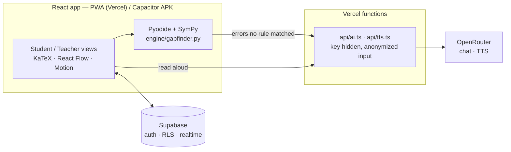

# Gap Finder

**Finds the one math skill behind a mistake.** A student writes their solution step by step; the app finds the exact line where it broke, names the misconception, and traces it back through a prerequisite skill graph to the root gap — often from years earlier. Teachers see which gaps their class shares and assign targeted practice in one click.

Built for the RAITE 2026 Hackathon · Personalized Learning Assistant & Classroom Analytics.

## The problem

Math builds on itself. One gap from years ago — a school transfer, a missed lesson, time away — breaks everything after it. But nobody finds that gap: a teacher with 40 students can't diagnose each one, an answer key only says *wrong*, and an adult returning to math has neither. So people conclude "I'm bad at math" when they're missing one specific, fixable skill.

## Design principle

**The AI never decides what's correct, and the verifier never explains.**

| Job | Done by |
|---|---|
| Is this step correct? Which term is wrong? | **SymPy** (exact, deterministic) |
| Common misconceptions | **Buggy rules** — apply a known wrong rule to the previous line and check with SymPy whether it reproduces the student's line. A match is certain. |
| Which prerequisite is the root gap? | **Graph walk** over the skill graph with quick SymPy-checked probes |
| Uncommon misconceptions, explanations, teacher insight, voice | **AI (OpenRouter)**, always with a check and a non-AI fallback |

## Features

- **Step-by-step diagnosis** — "Is this what you wrote?" confirmation, then the wrong term is circled next to the correct line.
- **Gap trace ("time travel")** — "Your Grade 9 mistake comes from a Grade 7 skill," animated down the skill map.
- **Roadmap** — explanation (English/Filipino), area-model visual, SymPy-graded practice, then a retry of the original problem.
- **Teacher dashboard** — students × skills grid, students grouped by shared root gap, live updates, confirm-before-assign with undo, diagnosis override, CSV export.
- **Works offline** — the SymPy engine runs on the device (Pyodide), so diagnosis works in airplane mode.
- **Privacy** — consent screen (RA 10173), AI only sees anonymized math, self-practice private by default, download/delete my data, AI decision log.
- **Accessibility** — read aloud, text size, readable font, reduced motion, not color-only (✓ / !), screen-reader description of the skill map.

## Architecture



| Path | What |
|---|---|
| `engine/gapfinder.py` | The engine: parsing, step equivalence (solution sets for equations), buggy rules, term diff, answer checking |
| `engine/golden.json`, `engine/test_gapfinder.py` | Golden test set + content validation (every probe and practice key verified by SymPy) |
| `src/data/*.json` | Skill graph, misconception library, lessons (EN/FIL), problems |
| `src/engine/` | Web Worker running the engine in Pyodide |
| `src/pages/` | Landing/consent, student home, solve, trace, learn, teacher, settings |
| `api/` | OpenRouter proxy (classification, teacher insight, TTS) |
| `supabase/migrations/0001_init.sql` | Schema, Row Level Security, gap summary view |
| `tests/demo.spec.ts` | The stage demo as a Playwright test (phone viewport) |

## Setup

```bash
npm install
npm run dev            # also vendors Pyodide + SymPy into public/pyodide (offline)
npm run test:engine    # engine + content tests (needs uv)
npm run test:e2e       # full demo flow in a phone-sized browser
npm run build
```

Environment (Vercel project settings, server-side only — see `.env.example`): `OPENROUTER_API_KEY`, `OPENROUTER_FAST_MODELS`, `OPENROUTER_TTS_MODEL`. Without a key the app still works: AI features fall back to pre-written content and the device voice.

## Test results

On our golden set of **34** hand-written student solutions (24 with a known error, 10 correct):

- Error line found: **24/24**
- Misconception identified (buggy rules only, no AI): **24/24**
- False alarms on correct solutions: **0/10**

Caveat: the set is small and was written by the team alongside the rules, so these numbers show the engine works as designed. They aren't a measure of accuracy on real student work.

## Responsible AI

- No final answers to assigned problems; it diagnoses and teaches the prerequisite.
- Every correctness decision (including practice answer keys) is made by SymPy.
- AI classification picks from a closed list or says "unknown"; low confidence isn't shown as a diagnosis. Students can flag a diagnosis; teachers can override it.
- Student text is passed to the model as delimited data, never as instructions.

## Notes

- Grade levels follow the DepEd K–12 curriculum guide. MATATAG competency codes are intentionally left blank until verified against the official guide.
- Filipino explanations need a native-speaker review.
- Kyla and the 9-Sampaguita class are demo personas; names are fictional.
