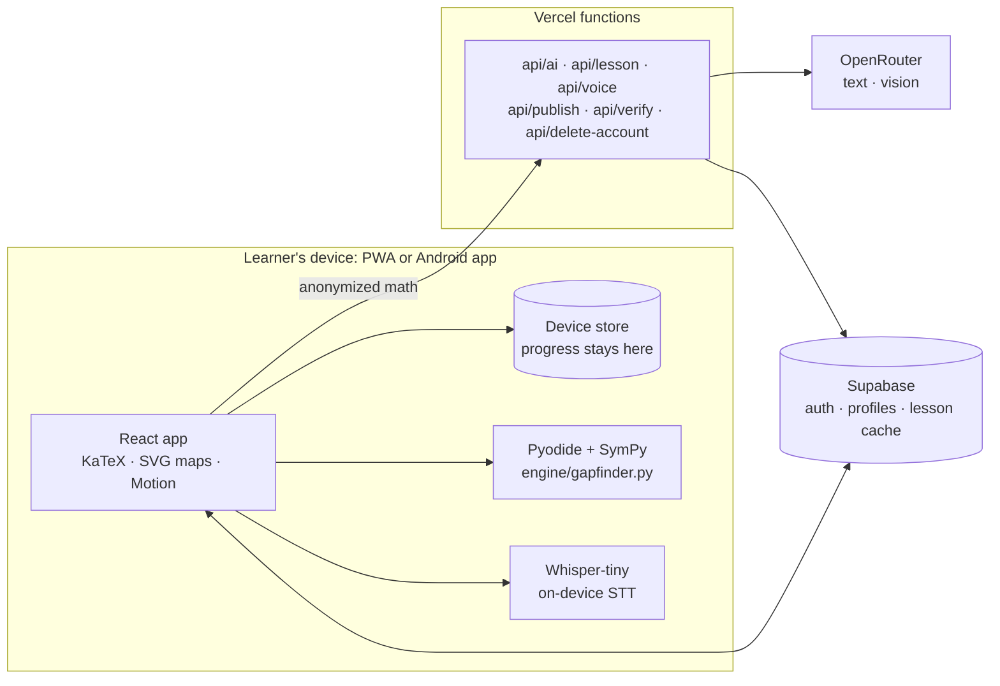

# Hopper

**Finds the one math skill behind a mistake.** A student writes their solution step by step; the app finds the exact line where it broke, names the misconception, and traces it back through a prerequisite skill graph to the root gap — often from years earlier. Hopper is built for students: everything is about the learner finding and fixing their own gaps.

Built for the RAITE 2026 Hackathon · Personalized Learning Assistant.

- **Live app:** https://hopper-rust.vercel.app
- **Android app:** build it from `android/` (see [Android app](#android-app))
- **Architecture and diagrams:** [docs/ARCHITECTURE.md](docs/ARCHITECTURE.md)
- **Repo:** https://github.com/Manflora27/hopper

## The problem

Math builds on itself. One gap from years ago — a school transfer, a missed lesson, time away — breaks everything after it. But nobody finds that gap: an answer key only says *wrong*, a busy classroom can't diagnose every student, and an adult returning to math has no one to ask. So people conclude "I'm bad at math" when they're missing one specific, fixable skill.

## Design principle

**The AI never decides what's correct, and the verifier never explains.**

| Job | Done by |
|---|---|
| Is this step correct? Which term is wrong? | **SymPy** (exact, deterministic) |
| Common misconceptions | **Buggy rules** — apply a known wrong rule to the previous line and check with SymPy whether it reproduces the student's line. A match is certain. |
| Which prerequisite is the root gap? | **Graph walk** over the skill graph with quick SymPy-checked probes |
| Uncommon misconceptions, explanations, lessons, starting-point checks, voice/photo transcripts | **AI (OpenRouter: GLM text + vision)**, always with a check and a non-AI fallback |

## Features

- **Step-by-step diagnosis** — "Is this what you wrote?" confirmation, then the wrong term is circled next to the correct line.
- **Gap trace ("time travel")** — "Your Grade 9 mistake comes from a Grade 7 skill," animated down the skill map.
- **Roadmap** — explanation (English, Filipino, Bisaya), area-model visual, SymPy-graded practice, then a retry of the original problem.
- **Voice input (18+)** — browser speech recognition where available, otherwise a short clip transcribed on-device (Whisper-tiny, offline after a one-time download); transcripts become typed math via AI online, via rules offline.
- **Snap my work** — photograph handwritten work; the vision model transcribes it as written, mistakes preserved.
- **Self-learners welcome** — no grade, no quarters: subjects only, starting at a default level while checks find the real one.
- **Light gamification** — XP with combo bonuses, confetti, and Bilog the mascot celebrating mastery; days-practiced and gaps-fixed counters. No streak anxiety.
- **Starting-point checks** — a short AI-written check per subject places the learner on a DepEd MATATAG study plan; offline, it falls back to built-in skills.
- **Help with any subject** — type or photograph a question and get feedback, a hint and worked steps.
- **Works offline** — the SymPy engine runs on the device (Pyodide), so diagnosis works in airplane mode; downloadable lesson packs and offline voice included.
- **Privacy** — consent screen (RA 10173), AI only sees anonymized math, learning data stays on the device, download my data.
- **Delete account** — Settings → Delete account permanently removes the account and everything saved with it (server and device).
- **Accessibility** — read aloud (device voice), text size, readable font, reduced motion, not color-only (✓ / !), screen-reader description of the skill map.

## Architecture

Full write-up with diagrams (system, diagnosis flow, lesson pipeline, sign-in, deployment): **[docs/ARCHITECTURE.md](docs/ARCHITECTURE.md)**.



| Path | What |
|---|---|
| `engine/gapfinder.py` | The engine: parsing, step equivalence (solution sets for equations), buggy rules, term diff, answer checking |
| `engine/golden.json`, `engine/test_gapfinder.py` | Golden test set + content validation (every probe and practice key verified by SymPy) |
| `src/data/*.json` | Skill graph, misconception library, lessons (EN/FIL, partial Bisaya), problems |
| `src/engine/` | Web Worker running the engine in Pyodide |
| `src/ai/speech.ts`, `src/ai/whisper.ts`, `src/ai/localMath.ts` | Tiered voice input: browser STT → on-device Whisper → offline transcript-to-math rules |
| `src/components/Bilog.tsx` | Bilog mascot: hand-drawn SVG, 9 moods, eye tracking, reduced-motion support |
| `src/pages/` | Landing/consent, onboarding, home, starting-point check, solve, trace, unit/learn, help, settings |
| `api/` | OpenRouter proxy (classification, placement, help, voice formatting, lessons, photo reading), lesson publishing with SymPy re-check, account deletion |
| `supabase/migrations/0001-0011` | Schema, Row Level Security, lesson cache (older classroom tables are unused) |
| `capacitor.config.ts`, `android/` | Android app: runs the deployed site, deep-link sign-in (`com.hopper.math://auth`) |
| `docs/ARCHITECTURE.md` | Architecture, data flow and diagrams |
| `tests/demo.spec.ts` | The stage demo as a Playwright test (phone viewport) |
| `docs/PLAN.md` | Full project plan: pitch, priorities, demo script, risks, build status |

## Setup

```bash
npm install
npm run dev            # also vendors Pyodide + SymPy into public/pyodide (offline)
npm run test:engine    # engine + content tests (needs uv)
npm run test:e2e       # full demo flow in a phone-sized browser
npm run build
```

Environment (Vercel project settings — see `.env.example`):

| Name | Purpose |
|---|---|
| `VITE_SUPABASE_URL`, `VITE_SUPABASE_PUBLISHABLE_KEY` | Sign-in and profiles (baked into the build) |
| `SUPABASE_URL`, `SUPABASE_SERVICE_ROLE_KEY` | Server only: shared lesson cache, account deletion |
| `OPENROUTER_API_KEY` | Server only: all AI features |
| `LESSON_SIGNING_KEY` | Server only: any long random string; signs lesson drafts |

Without the AI key the app still works: AI features fall back to pre-written content and the device voice.

Supabase → Authentication → URL Configuration: Site URL `https://hopper-rust.vercel.app`; Redirect URLs `https://hopper-rust.vercel.app/**`, `com.hopper.math://**`, `http://localhost:5173/**`. Run `supabase/migrations/` in order on a new project.

## Android app

```bash
npm run build && npx cap sync android
cd android && ./gradlew assembleDebug    # needs JDK 21 (Android Studio's jbr) and the Android SDK
# → android/app/build/outputs/apk/debug/app-debug.apk
```

The app loads https://hopper-rust.vercel.app (`capacitor.config.ts`), so web deploys update it without a new APK. Google sign-in opens in a Chrome tab and returns to the app through `com.hopper.math://auth/callback`.

LLM spend (OpenRouter list, Oct 2026 — verify live; providers are pinned): text ~$0.15/$0.60 per 1M in/out tokens, vision ~$0.075/$0.25. Per call that's ~$0.0002 for classify/tips/voice, ~$0.001 per photo read or placement check, ~$0.01 per generated lesson — but lessons are cached and shared, so each one is paid ~once. Cost controls: temperature 0 with strict JSON schemas (short outputs), capped inputs, at most one retry, no silent provider rerouting (`allow_fallbacks: false`), and full offline fallbacks that skip the call entirely. Set an OpenRouter credit limit before demo day.

## Test results

On our golden set of **34** hand-written student solutions (24 with a known error, 10 correct):

- Error line found: **24/24**
- Misconception identified (buggy rules only, no AI): **24/24**
- False alarms on correct solutions: **0/10**

Caveat: the set is small and was written by the team alongside the rules, so these numbers show the engine works as designed. They aren't a measure of accuracy on real student work.

## Responsible AI

- No final answers to assigned problems; it diagnoses and teaches the prerequisite.
- Every correctness decision (including practice answer keys) is made by SymPy.
- AI classification picks from a closed list or says "unknown"; low confidence isn't shown as a diagnosis. Students can flag a diagnosis they disagree with.
- Student text is passed to the model as delimited data, never as instructions.

## Notes

- Grade levels follow the DepEd K–12 curriculum guide. MATATAG competency codes are intentionally left blank until verified against the official guide.
- Filipino explanations need a native-speaker review.
- Kyla is a demo persona; the name is fictional.
