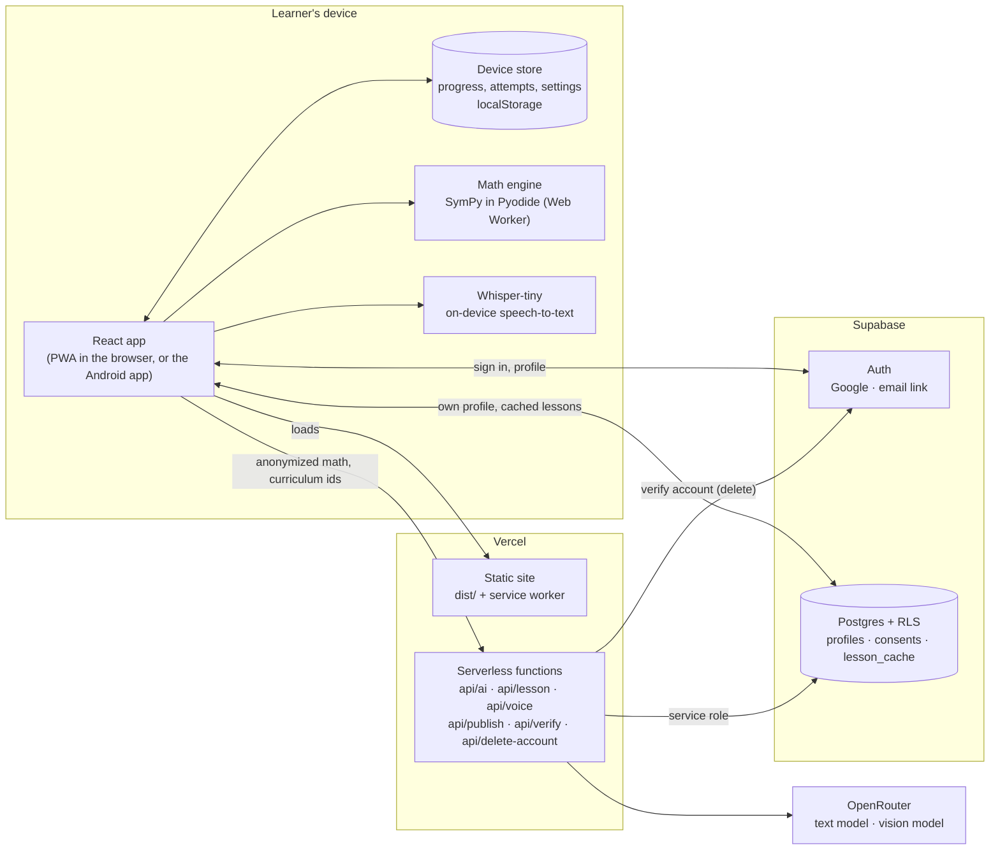
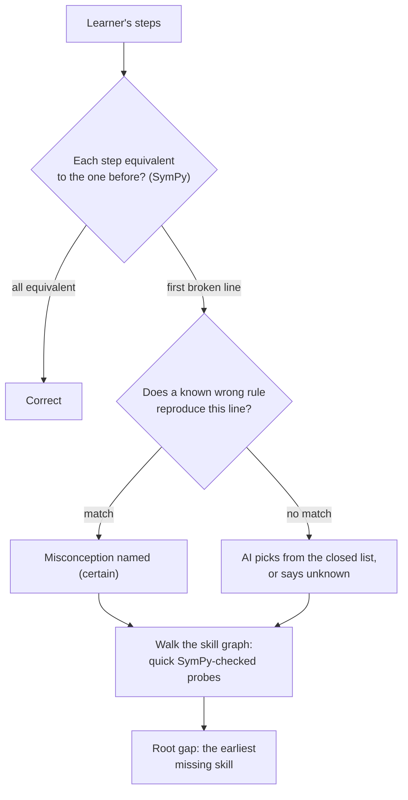
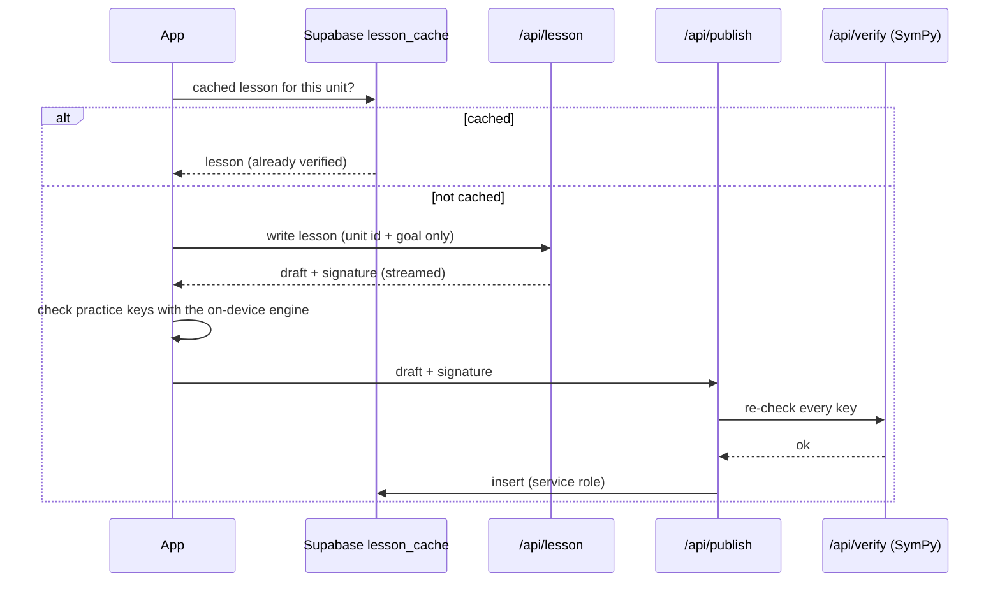
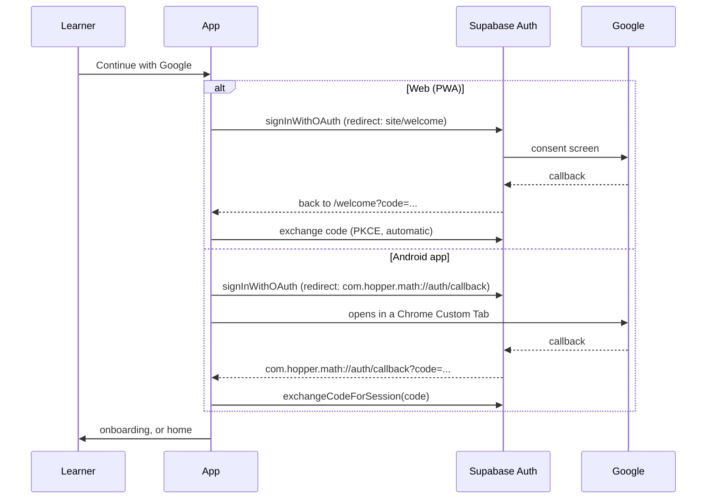
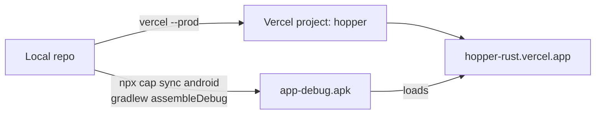

# Hopper architecture

Hopper is a learning app for students. A learner shows their work step by step; Hopper finds the line where it went wrong, names the misconception, and traces it back to the earlier skill that's missing. Then it teaches that skill, checks practice answers exactly, and sends the learner back to the original problem.

This document covers how the pieces fit together: the app, the math engine, the AI proxy, the database, sign-in, and the Android build.

Live app: https://hopper-rust.vercel.app

## 1. System overview

Three rules shape the design:

1. **The AI never decides what's correct.** Every correctness decision (a student's step, a practice answer key, a lesson's examples) is made by SymPy. The AI writes explanations and handles what rules can't, and every AI call has a non-AI fallback.
2. **Learning data stays on the device.** Progress, attempts and roots live in the device store. The server holds only the account, its profile, its consent record and the shared lesson cache, which contains no student data.
3. **It works offline.** The engine runs in the browser, so diagnosis works in airplane mode. Lessons can be downloaded per subject, and voice input has an on-device model.

## 2. The app (`src/`)

React 19 + Vite + Tailwind, routed with React Router, state in Zustand.

| Area | Files | What it does |
|---|---|---|
| Routes | `src/App.tsx` | Landing → onboarding (`/welcome`) → home (`/student`). Learning routes are gated: signed in and onboarded, or a guest/demo session. |
| Sign-in & profile | `src/auth.ts`, `src/lib/supabase.ts` | Supabase auth (Google, email magic link, PKCE). Profile create/update. Account deletion. Native deep-link sign-in for the Android app. |
| Device store | `src/store.ts`, `src/account.ts` | Persisted learner state. On a shared phone, signing out sets one account's data aside and restores it when that account signs back in. |
| Onboarding | `src/pages/Welcome.tsx` | Name → grade (or self-learner) and subjects → generated study plan. |
| Placement | `src/pages/Check.tsx` | A starting-point check per subject (AI-written, streamed; offline fallback to built-in skills). |
| Diagnosis | `src/pages/Solve.tsx`, `src/pages/Trace.tsx` | Step-by-step input, "is this what you wrote?", error line circled, then the walk down the skill graph to the root gap. |
| Lessons & practice | `src/pages/Unit.tsx`, `src/pages/Learn.tsx`, `src/lessons/` | Lesson generation pipeline (cache → server → offline pack), SymPy-graded practice. |
| Help with any subject | `src/pages/Help.tsx` | Type or photograph a question; get feedback, a hint and worked steps. |
| Settings | `src/pages/Settings.tsx` | Language (EN / Tagalog / Bisaya), reading aids, exam mode, voice, download my data, **delete account**. |
| Curriculum | `src/data/` | DepEd MATATAG plan, competencies, skill graph, misconception library. |
| Voice | `src/ai/speech.ts`, `src/ai/whisper.ts`, `src/ai/localMath.ts` | Browser speech recognition → on-device Whisper → rules that turn spoken math into typed math offline. |

## 3. The math engine (`engine/gapfinder.py`)

The same Python file runs in two places:

- **In the browser**, inside a Web Worker on Pyodide (`src/engine/worker.ts`). Pyodide and SymPy are copied into `public/pyodide` at build time (`scripts/fetch-pyodide.mjs`), so nothing is downloaded from a CDN.
- **On the server**, as `api/verify.py`, to re-check AI-written lesson answer keys before they're shared.

## 4. Server functions (`api/`)

All of them run on Vercel. API keys exist only here.

| Endpoint | Purpose | Notes |
|---|---|---|
| `POST /api/ai` | `classify` (a misconception from the closed list), `placement` (starting-point check), `help` (any-subject help), `read-work` / `read-question` (photo → text) | Streams NDJSON for long answers. Strict JSON schemas, temperature 0, at most one retry. |
| `POST /api/lesson` | Writes a lesson for one curriculum unit | Returns the draft with an HMAC signature (`LESSON_SIGNING_KEY`), so only server-written drafts can be published. |
| `POST /api/publish` | Shares a verified lesson | Checks the signature, re-checks every answer key with `/api/verify`, then writes `lesson_cache` with the service role. |
| `POST /api/verify` | SymPy re-check of answer keys | Python function running `engine/gapfinder.py`. |
| `POST /api/voice` | Transcript → typed math | Text only: audio never leaves the device. |
| `POST /api/delete-account` | Deletes the caller's account | Gets the user from their own access token (never a client-sent id), then deletes the auth user. `profiles` cascades to everything they own. |

Model routing is in `api/_openrouter.ts`: a pinned text model and a pinned vision model, with providers pinned and `allow_fallbacks: false`, so a request never silently goes elsewhere.

## 5. Lessons: how one gets made once and shared

No student data is part of a lesson request: only the curriculum unit id and a framing goal (catch up / explore / exam prep).

## 6. Data and privacy (RA 10173)

| Data | Where it lives | Who can read it |
|---|---|---|
| Progress, attempts, roots, XP, settings | Device store (localStorage) | Only the device |
| Account (email, Google id) | Supabase Auth | The learner |
| Profile (display name, grade, subjects, language) | `profiles` | The learner (RLS: `id = auth.uid()`) |
| Consent record | `consents` | The learner |
| Lessons | `lesson_cache` | Any signed-in learner; written only by the server |

- **Download my data** exports the device store as JSON.
- **Delete account** calls `/api/delete-account`, which removes the auth user. The `profiles` row and everything that references it are deleted by cascade. Then the device store is cleared.
- The AI sees anonymized math and curriculum ids, never names. Student text is passed as delimited data, never as instructions.

The database schema is in `supabase/migrations/` (0001–0011). Earlier migrations also created classroom tables (`classes`, `memberships`, `assignments`, `assignment_results`, `attempts`, `skill_progress`). The app no longer reads or writes them; they can be dropped in a later migration.

## 7. Sign-in

Google refuses to sign in inside an embedded web view, so the Android app opens sign-in in the system browser and returns through the `com.hopper.math://auth` link. The intent filter for it is in `android/app/src/main/AndroidManifest.xml`.

Required Supabase settings (Authentication → URL Configuration):

- Site URL: `https://hopper-rust.vercel.app`
- Redirect URLs: `https://hopper-rust.vercel.app/**`, `com.hopper.math://**`, and `http://localhost:5173/**` for local development

## 8. Android app (Capacitor)

`capacitor.config.ts` points the app at the deployed site (`server.url`), so the Android app runs the same code as the web and reaches `/api` without extra setup. Plugins: `@capacitor/app` (deep links) and `@capacitor/browser` (sign-in tab). The app needs a connection on first launch; after that the service worker caches the site.

## 9. Deployment

Vercel environment variables:

| Name | Used by |
|---|---|
| `VITE_SUPABASE_URL`, `VITE_SUPABASE_PUBLISHABLE_KEY` | The app (baked in at build time) |
| `SUPABASE_URL`, `SUPABASE_SERVICE_ROLE_KEY` | `api/publish`, `api/delete-account` |
| `OPENROUTER_API_KEY` | All AI endpoints |
| `LESSON_SIGNING_KEY` | Signing and checking lesson drafts |

Optional: `OPENROUTER_TEXT_MODEL`, `OPENROUTER_VISION_MODEL`, `*_PROVIDERS` and `*_EFFORT` to change model routing.
