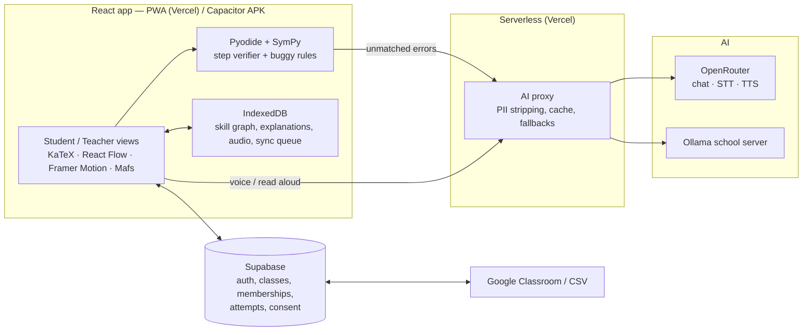

# Project Overview: Gap Finder — AI Math Gap Finder

> **Status (Oct 2):** The Must-tier demo is built and tested. See [Build Status](#build-status) at the end. Sections below are the original plan; notes marked *Built:* describe what changed during the build.

## Context
- **Event:** RAITE 2026 Hackathon (October 2, 2026)
- **Eligible categories:** Personalized Learning Assistant & Classroom Analytics
- **Problem statements addressed:** personalized learning, STEM education, early identification of at-risk students, learning analytics, inclusive education
- **Target audience:** Junior and Senior High School, Grades 7–12 (MVP). Scales to ALS learners, college bridging, and adults revisiting math.
- **Subject scope:** Mathematics. The MVP covers one strand: Algebra, from integers through quadratics. The engine extends to any *verifiable* subject.

> **Scope warning:** This is more than three people can build in one day. Build in priority order (Must → Should → Nice). Anything unfinished moves to Future Work in the slides.

---

## The Problem
Math builds on itself. One gap from years ago, caused by a school transfer, a missed lesson, or just time away, breaks everything after it.

But nobody finds that gap. A teacher with 40 students can't diagnose each one. An answer key only says you're wrong, not where or why. And an adult coming back to math has neither.

So people conclude "I'm bad at math," when they're really missing one specific, fixable skill.

## The Solution
One app with a **student view** and a **teacher view**. It's built on a diagnostic engine that analyzes a learner's actual step-by-step work instead of just scoring answers.

**Usage model:** Schools deploy it and teachers assign gap practice. Anyone can also use it on their own at any time. Both paths use the same engine and the same account.

## Core Design Principle
**The AI never decides what's correct, and the verifier never explains.**
A symbolic math engine (SymPy) checks correctness exactly. The AI handles what a checker can't:
- reading voice and handwritten input
- recognizing uncommon misconceptions
- explaining at the student's level, in their language
- generating practice

AI labs use this same idea to train models on math (verifiable answers). Here it's applied to the student instead of the model.

**Why only math (the judges' likely question):** "Because we refuse to let the AI decide what's correct. Math is where we can verify every step. The engine extends to any subject with a verifier: physics, chemistry, programming. It doesn't extend to essays, and we won't pretend it does."

---

## Educational Impact: Two Loops
**1. Learning loop (student)**
1. Student attempts a problem.
2. Engine finds the error line and circles the wrong term.
3. Engine identifies the misconception.
4. Engine traces the root gap.
5. Student gets an explanation, then targeted practice.
6. Student retries the original problem.
7. Skill is marked ✓ on the map.

If the retry fails, the engine digs one level deeper.

**2. Grading and intervention loop (teacher)**
1. Teacher assigns a diagnostic, and students submit.
2. Engine analyzes every solution step by step.
3. Teacher reviews the results and can override any diagnosis.
4. Dashboard groups students by shared gaps.
5. Teacher assigns targeted practice in one click.
6. Students' progress updates the dashboard.

Teachers stop grading only for scores and start seeing *why* students got it wrong, without checking 40 papers line by line.

## How the Engine Works
1. **Input:** Typed steps (default). Voice (OpenRouter STT) and photo of handwritten work are add-ons.
2. **Parsing:** The AI converts the input into math expressions and shows them back. The student confirms or edits them before checking.
3. **Verification:** SymPy checks whether each step is equivalent to the previous one. The first non-equivalent step is the error line. SymPy also compares the expanded terms of the two lines to find the exact term that went wrong.
4. **Misconception classification (hybrid):**
   - *Buggy-rule matching (offline, deterministic):* The engine applies known wrong rules (e.g., (a+b)² → a²+b²) and checks with SymPy whether the student's step matches. An exact match makes the misconception certain.
   - *AI classification (online):* For errors no rule matches, an LLM classifies the error against the misconception library and returns structured JSON with a confidence score. Jev handles this step if the organizers approve it.
5. **Gap tracing:** The engine walks down a prerequisite skill graph mapped to DepEd MATATAG competencies until it finds the lowest unmastered skill.
6. **Roadmap:** An explanation plus practice problems for that skill. SymPy verifies every answer key.
7. **Progress:** The skill turns ✓ on the map, and the student retries the original problem.

## AI Integration
**Rule: use AI only where a deterministic method can't do the job, and give every AI output a check.**

| # | Job | When it runs | Input → output | Check |
|---|---|---|---|---|
| 1 | **Read non-typed input** | Voice/photo only (typed input goes through MathLive, no AI) | Transcript/image → `{steps: [latex], confidence[]}` | Student confirms; low confidence highlights the symbol |
| 2 | **Classify misconception** | Only when no buggy rule matched | Problem, previous step, error step, SymPy's wrong terms, **closed list of candidate misconception IDs** → `{id \| "unknown", confidence, evidence}` | Enum-only output; below threshold → "unclear" path; teacher can override |
| 3 | **Personalize the explanation** | After diagnosis | Pre-generated base explanation + the student's own wrong step + language → `{text, spoken, katex}` | Must not contain the assigned problem's final answer (SymPy scans it); cached per key |
| 4 | **Generate practice** | Batch, ahead of time (live only if the pool runs out) | Skill + difficulty → problems | SymPy solves each one to make the answer key; rejects unsolvable or messy ones |
| 5 | **Teacher insight** | On the dashboard | SQL aggregate only (no names) → "14 students are missing negative fractions; suggested 10-min mini-lesson: …" | Grounded only in numbers from the query; the teacher decides |

**Not AI (deterministic):** correctness (SymPy), error line and wrong terms (SymPy), common misconceptions (buggy rules), and gap tracing (graph walk over the prerequisite graph). The AI never chooses the next prerequisite. The graph does.

**Model tiers (via OpenRouter, chosen tonight by testing):**
- **Fast/cheap tier** for jobs 1, 2 and 5: low temperature, strict JSON schema.
- **Strong tier** for the batch content generation in jobs 3 (base explanations) and 4.
- Fallback model configured for each tier. Voice: Whisper for STT; TTS model for read-aloud.

**Prompting:**
- System prompt: role, grade level, language/Taglish style, and the "never give the final answer" rule.
- Few-shot examples taken from the golden test set.
- Student text is passed as **delimited data**, never as instructions (prompt-injection guard). The output schema limits what it could change anyway.
- Outputs are validated with Zod; retry once, then fall back.

**Speed & cost:**
- Most content is pre-generated, so live calls are only jobs 1, 2, the personalization in 3, and 5.
- Cache by `(skill, misconception, language)`.
- Stream the explanation text so it starts appearing immediately.

**Evaluation:** the golden test set measures the error line (SymPy, should be ~100%) and misconception accuracy (buggy rules + AI) separately. These are the "[X/N]" and "[Y/N]" numbers.

**Nice tier:** an "Ask why?" follow-up chat limited to the current skill, with the same never-the-answer rule.

## AI Scoping & Human Control
The AI suggests; people decide. Consequential actions ask for permission, and edits can be undone.

| Action | AI's role | Human control |
|---|---|---|
| Reading the student's work | Parses input | Student confirms or edits (undo/redo on steps) |
| Diagnosing the error | Classifies the misconception | Student can flag "this doesn't seem right"; teacher can override |
| Sharing results with the teacher | None | Only for assigned work, or if the student turns sharing on |
| Assigning practice | Suggests groups by gap | Teacher confirms before sending; undo available |
| Recording a grade | Never automatic | Teacher approves every recorded score |

All AI actions are logged with what the AI suggested and what the person decided.

---

## Platform
**One React codebase, two outputs:**

```
          React app (one codebase)
            ↓                    ↓
  PWA (deploy to Vercel)      Capacitor (wraps the same build)
  URL / QR code, install      Android APK with an app icon
```

- **Build and test everything as the web app.** That's where the fast agent loop is. Wrap it with Capacitor at the end.
- **PWA:** judges scan a QR code, teachers use laptops, and anyone can install it with a one-tap "Install app" button (Android). iOS shows "Share → Add to Home Screen" instructions.
- **Capacitor APK:** pre-installed on the demo phones, so the demo launches from an app icon. Web files are bundled in the app, so it works offline from install.
- **Not Expo:** no one on the team has shipped it, the math libraries are web-only, and its test loop (emulator plus native rebuilds) is slow for AI-assisted coding. If the Capacitor build fails, the web demo still works.
- Designed for low-end Android phones first.

## Accounts & Roles
**Model (like Coursera / Microsoft Learn):** each learner owns one account. A school or class is a *membership* added on top of that account, not the owner of it.

| Path | How you join | Who sees your work |
|---|---|---|
| **Try it** (no account) | Run one diagnostic straight away | Nobody; it's stored on the device. "Save your skill map" prompts sign-up. |
| **Solo learner** | Sign up with Google or an email code | Only you |
| **Class member** | Same account + enter a class code (or invite link) | Your teacher sees *assigned* work; self-practice stays private unless you share it |
| **Teacher** | Sign up and create a class | Only their own sections |
| **School admin** (future) | Verified by the school | Approves teachers, manages rosters |

**Rules:**
- One account can be in several classes and can also practice solo. Visibility is set per piece of work, not per account.
- **When a student leaves a class, the school's access ends, but the learner keeps their skill map.**
- **Minors:** consent through the school for the class path; guardian consent for solo sign-up under 18.
- **Teacher verification:** in the MVP, anyone can create a class. In the future, school admins approve teachers, with SSO through Google Workspace for Education / Microsoft 365.

**Implementation:**
- Supabase Auth: Google OAuth (browser redirect) + **email 6-digit OTP code** instead of magic links. Links open in the browser, not the installed PWA or app, so the session would land in the wrong place.
- In Capacitor, Google blocks OAuth inside WebViews. Use native sign-in via `@capgo/capacitor-social-login` → `supabase.auth.signInWithIdToken()`, or just the email code for the demo APK. On iOS, add Sign in with Apple (Apple requires it when Google sign-in is offered).
- Tables: `users`, `classes`, `memberships(user, class, role)`, `assignments`, `attempts(visibility)`.
- Supabase Row Level Security enforces the visibility rules, so this is real role-based access, not UI-only.
- **Demo:** pre-seeded accounts (Kyla, Ms. Santos, 13 classmates) and a "Demo as Student / Teacher" switcher on the login screen. Keep real auth working behind it in case judges ask.

## User Flow & UI/UX
**Student entry:** Consent screen → "Join my class" (class code) or "Practice on my own." Or "Try it" with no account.

**Student home:**
- **Assignments** (class students only), e.g., "Algebra check from Ms. Santos, due Friday."
- **My Skill Map:** the student's prerequisite graph, with mastered skills ✓ and gaps !
- **"Stuck on a problem? Check my work":** starts a diagnosis on any problem.

**Core diagnosis flow:**
1. Student enters steps.
2. App asks "Is this what you wrote?"
3. The wrong term is circled.
4. The map traces down to the gap.
5. Student goes through the roadmap.
6. Student retries the original problem, and the skill turns ✓.

**Visibility:** Assigned work is visible to the teacher. Self-practice is private by default, labeled "Only you can see this," with an optional "Share my skill map with my teacher" toggle.

**Teacher flow:**
1. Create a class and share the class code.
2. Assign a diagnostic.
3. Open the dashboard: a students × skills grid with summaries like "14 students are missing negative fractions."
4. Review and override diagnoses.
5. Click "Assign practice to these 14" and confirm.
6. Students receive assignment cards.

## Visual Design (Khan Academy / 3Blue1Brown quality, selectively)

> *Built (Oct 2):* mobile-first, editorial-warm identity built around "find the root": **Young Serif** headings (pairs with KaTeX's serif math) and **Atkinson Hyperlegible Next** body text (designed for low-vision readers); warm ivory paper with grain, pine ink, persimmon for gaps, moss for mastered; hairline rules and soft depth (no neobrutalism, no emoji). Signature motif: a hand-drawn ink circle (wrong term, root gap, logo). The skill map is a root system with real prerequisite edges; the trace draws the route down to the root. Bottom tab bar, calculator-style math keypad, "gaps fixed" counter. The principles below still apply.
**Principle:** Polish comes from a calm, consistent design system first and animation second. Pick a few moments and make them great. Don't use Manim or rendered video; everything is live SVG in React.

**Foundations:**
- One type scale, one spacing scale, and a small palette (Tailwind + shadcn/ui)
- KaTeX for all math
- **Gaps are amber, not red.** Results are framed as discovery, not failure: "Found it: the gap is negative fractions," never "You got it wrong."

**Signature moments, in build order:**

| # | Moment | Tier | Timebox | How |
|---|---|---|---|---|
| 1 | KaTeX for all math | Must | 30 min | `katex` |
| 2 | Static skill map (top-down layered graph) | Must | 1.5 h | React Flow with **node positions precomputed in the skill-graph JSON** (no live layout, so nothing jitters on stage) |
| 3 | Step comparison: wrong term circled, the way a teacher marks it | Should | 1 h | SymPy term diff → highlight in KaTeX |
| 4 | Gap-trace animation: edges light up node by node down to the gap | Should | 2 h | Framer Motion, about 2–3 s total, skip button |
| 5 | One explainer visual for Kyla's gap | Should | 2 h | Mafs number line (negative fractions), or SVG area model for (a+b)², where the missing 2ab rectangles appear |
| 6 | Explainers for other misconceptions | Nice | — | Future Work |

**Rules:**
- Choose Kyla's root gap before building item 5. Build only that one explainer.
- Respect `prefers-reduced-motion`: the trace becomes an instant highlight.
- On low-end phones, animate only opacity and stroke, never the layout.
- The demo must still work if items 4 and 5 aren't finished.
- Use Khan Academy and 3Blue1Brown as a quality bar only. Don't copy their colors or characters, and don't say "like 3Blue1Brown" on stage.

## Wow Factors
Each one must **show the core idea** (find the real gap), not just decorate. Ranked by impact versus cost:

| # | Moment | Cost | Tier |
|---|---|---|---|
| 1 | **"Time travel" trace:** each skill node carries its grade level, and the trace narrates "Your Grade 9 quadratics mistake → comes from a **Grade 7** skill." Show the real MATATAG code under the gap. | ~30 min (grade field in JSON) | Must |
| 2 | **"Try to fool it":** a QR code on the final slide plus a challenge card ("Solve this and make a mistake on purpose"). Judges see their own error circled on their own phone. | Almost no build; needs a robust engine on the challenge problems (add them to the golden set) | Should |
| 3 | **Live teacher dashboard:** teammates submit from 3–4 phones during the demo, and the grid updates in real time ("14 → 17 students missing negative fractions"). | 1–2 h (Supabase Realtime subscription) | Should |
| 4 | **Airplane mode:** it still diagnoses offline. | Already in the plan | Should |
| 5 | **Retry payoff:** the problem that stopped her gets solved, and the node turns ✓ with a short, calm celebration. | 30 min | Should |
| 6 | **Taglish voice:** "x squared minus tatlo equals..." → parsed into math. | Already planned (STT) | Nice |

**Skip:** badges and points, avatars and mascots, 3D/AR, a general chatbot. They're common at hackathons and don't show the gap-finding idea.

## Accessibility
- **Read aloud (TTS):** OpenRouter TTS reads a `spoken` version of each explanation ("negative three over four"), never raw LaTeX.
- **Voice input (STT):** spoken steps → transcript → AI math parse → student confirms, like any other input.
- **Readable design:** high contrast, adjustable text size, and a dyslexia-friendly font option.
- **Not color-only:** ✓ and ! icons with labels.
- **Reduced motion:** all animations have a static fallback.
- **Keyboard and screen reader support:** labeled buttons, logical focus order, and a text description of the skill map.

## Multilingual Support
- **Interface:** English and Filipino.
- **Explanations:** English, Filipino, or Taglish, chosen by the student.
- **Kapampangan (experimental):** text-only explanations as a pilot, reviewed by a native speaker before use. No audio.
- **Offline:** pre-generated explanations, with cached TTS audio, for each skill and common misconception, in English and Filipino.

## Offline Capability & Caching
- **App shell:** cached by the PWA service worker, or bundled in the Capacitor APK.
- **Verification:** SymPy runs in the browser via Pyodide.
- **Diagnosis:** buggy-rule matching works offline. Uncommon cases are queued for AI analysis when the connection returns.
- **Content:** the skill graph, misconception library, explanations, TTS audio, and practice problems are cached in IndexedDB.
- **Speech offline:** cached audio plays. Voice input falls back to typing, and uncached read-aloud shows "Read aloud needs internet."
- **Sync queue:** work done offline is saved locally and synced on reconnect.
- **Response cache:** AI explanations for the same skill and misconception are reused across students.
- **School option:** Ollama with a local model on one school computer.

## Data Privacy (RA 10173, Data Privacy Act of 2012)
Education information counts as sensitive personal information under the Act, so student performance data needs extra protection.
- **Consent:** a clear consent screen before use, with parent or guardian consent for minors. Consent is logged.
- **Transparency, legitimate purpose, proportionality:** collect only math work and skill progress, use it only for diagnosis and teaching, and explain this in plain language.
- **Data subject rights:** learners and parents can view, download, correct, and delete their data from settings.
- **Anonymization:** the AI only receives randomized IDs (e.g., "Student 402") with the math work. No names are sent.
- **Voice:** audio is sent for transcription, then discarded without being stored. This is disclosed on the consent screen.
- **Security:** encryption in transit and at rest. Role-based access is enforced by Row Level Security: teachers see only their own sections and only assigned or shared work.
- **Retention:** the school's access ends when a student leaves a class, and the learner keeps their own data. Accounts inactive for a set period are deleted after notice.
- **School deployment:** the school's Data Protection Officer approves use, and breaches are reported to the National Privacy Commission.
- *Have someone who knows the law well review this section before it goes in the slides.*

## Responsible AI
- **No cheating:** the app never gives the final answer to an assigned problem.
- **Verified correctness:** SymPy makes all correctness decisions, including practice answer keys.
- **Human in the loop:** students confirm parsing, teachers can override, and no grade is recorded without teacher approval.
- **Transparency:** each diagnosis shows the error line, the circled term, the matched misconception, and the confidence.
- **Tested:** on 34 hand-written sample solutions (24 with a known error, 10 correct): error line found 24/24, misconception identified 24/24 (buggy rules only, no AI), false alarms 0/10. *Caveat:* the team wrote these alongside the rules, so they show the engine works as designed, not accuracy on real student work.

## Error Handling
| Situation | What the app does |
|---|---|
| AI model fails or times out | OpenRouter fallback model → cached response → offline buggy-rule diagnosis |
| No internet | Offline mode: verification and common misconceptions still work; the rest is queued |
| Input can't be parsed | "We couldn't read step 3. Can you retype it?" with the problem part highlighted |
| Low parsing confidence | Highlight the unclear symbol and ask the student to confirm |
| SymPy can't evaluate a step | Mark it "couldn't verify" instead of guessing, and let the student continue |
| Malformed AI output | Validate the JSON → retry once → fall back |
| Voice not understood | Show the transcript and ask the student to retype or retry |
| Invalid class code | Clear message with a "Practice on my own" option |
| Rate limit | Queue the request and show progress |

Users see plain-language messages only, and all errors are logged.

---

## Architecture & Tech Stack
- **Frontend:** React + Vite + Tailwind/shadcn. Deployed as a PWA on Vercel and wrapped with Capacitor for Android.
- **Visuals:** KaTeX, React Flow, Framer Motion, Mafs
- **Engine:** one pure-Python module (SymPy, buggy rules, gap tracing). It runs in the browser via Pyodide, under pytest for tests, and under FastAPI as a fallback if Pyodide is too slow on phones.
- **AI proxy:** a Vercel serverless function that hides keys, strips personal data, caches responses, and calls OpenRouter.
- **AI (OpenRouter):**
  - Chat with structured output for parsing, classification, explanations, and practice, using OpenRouter fallback models for provider switching
  - STT: `/api/v1/audio/transcriptions` (e.g., `openai/whisper-large-v3`). Record with MediaRecorder (webm on Chrome, m4a on iOS).
  - TTS: `/api/v1/audio/speech` (e.g., `openai/gpt-4o-mini-tts-2025-12-15`), `response_format: mp3`
  - Ollama for local school deployment; Jev for classification if approved
- **Database/Auth:** Supabase (Auth, Row Level Security; classes, memberships, assignments, attempts, progress, consent logs)
- **Offline storage:** IndexedDB


Paste this into mermaid.live to export an image for the slides and README.

## Scalability & LMS Integration
- **Scales cheaply:** verification runs on the learner's device, the AI is called only for uncommon errors and new explanations, and cached responses and audio are reused.
- **Curriculum expansion:** new strands are added as JSON skill graphs. That's content work, not new code.
- **New audiences:**
  - **ALS (Alternative Learning System):** DepEd's program for out-of-school youth and adults. It already uses the K–12 competencies, so the same skill graph fits.
  - College bridging and remedial math
  - Adults preparing for exams (e.g., the Civil Service Exam's numerical section)
- **New subjects:** any verifiable subject (physics and chemistry calculations, statistics, programming), by adding a skill graph, a misconception library, and a verifier.
- **LMS:** CSV export is in the MVP. Google Classroom and Moodle/LTI 1.3 are roadmap items.

---

## Build Process (AI-assisted coding)
The bottleneck is AI generation speed, tool calls, and testing, so the plan is optimized for short agent feedback loops.

**1. Freeze contracts first (first ~45 min, humans).** Write the JSON schemas and fixtures before any code:
- `skill-graph.json`: nodes, edges, MATATAG codes, x/y positions
- `misconceptions.json`: id, buggy rule, linked skill, explanation keys
- Engine I/O: `steps[] → { errorLine, wrongTerms, misconceptionId, confidence, rootSkill }`
- AI proxy request/response shapes, including the `spoken` field
- Seed data (Kyla + 13 classmates, Ms. Santos)

**2. Then run parallel agents on independent modules,** each one testable alone:

| Module | Fast test loop |
|---|---|
| Engine (pure Python) | `pytest` against a golden set of sample student solutions. No UI, no network, runs in seconds. |
| AI proxy (OpenRouter chat + audio) | Recorded fixtures (record/replay), so tests never wait on an LLM |
| Student UI | Vite dev server + Playwright scripts driving the demo flow, with screenshots |
| Teacher dashboard + auth | Same, against seed data |
| Content (explanations EN/FIL, `spoken` fields, practice, TTS audio) | Generated in a batch, with SymPy checking every answer key |

**3. Shared assets do double duty:**
- The **golden test set** is also the source of the Responsible AI "[X/N]" numbers.
- **Recorded AI fixtures** are also the demo's offline/WiFi-failure cache.
- The **engine is one Python module**, run by pytest, Pyodide, and FastAPI. It's the same code everywhere.

**4. Keep the slow parts out of the loop:**
- No live LLM calls in tests.
- No Capacitor builds until the end; everything is developed and tested in the browser.
- Animations and visuals need human eyes, so they're timeboxed and checked by a person, not iterated by agents.

**5. Integration checkpoints:** every ~2 hours, merge and run the full Playwright demo flow. The demo flow script *is* the acceptance test.

## MVP Build Priorities
**Must (core demo, build first)**
- Parsing with confirmation, SymPy step verification, misconception classification, gap tracing
- Static skill map + roadmap with retry; KaTeX everywhere; design system (amber gaps, ✓/! icons)
- English and Filipino explanations
- Supabase Auth + memberships + RLS; seeded demo accounts and a Student/Teacher demo switcher
- Teacher dashboard with a seeded class (Kyla + 13 classmates) and one hardcoded class code
- Consent screen, plain-language errors, cached fallback for demo samples
- PWA deployed on Vercel with a QR code
- README, architecture diagram, PPT

**Should (build if the core works)**
- Step comparison with the circled term; gap-trace animation; one explainer visual for Kyla's gap
- **Capacitor Android APK**, pre-installed on the demo phones. One teammate owns it.
- One-tap "Install app" button; offline mode with buggy-rule matching
- "Try it" with no account
- Read aloud (OpenRouter TTS) with cached audio
- Undo/redo on steps; teacher override and confirm-before-assign
- Privacy toggle and data download/delete; CSV export

**Nice (otherwise Future Work)**
- Voice input (OpenRouter STT); photo upload
- Explainers for other misconceptions
- Kapampangan; Ollama; Jev; Google Classroom; iOS build

## Deliverables
**README:** name + one-liner → problem → features → screenshots → architecture diagram → tech stack → setup (env vars, install, run, Capacitor build) → AI use and safeguards → privacy/RA 10173 → test results → team and roles → future work.

**Presentation:** final slides in PowerPoint (not HTML). Use the harness only for prototyping and rehearsing the script.

**PPT outline (~10 slides)**
1. Title and team
2. Kyla's story
3. The problem: nobody finds the gap, in class, at home, or as an adult
4. Solution and usage model
5. Design principle: the verifier checks, the AI explains, the graph diagnoses
6. Live demo (student, then teacher)
7. Architecture diagram
8. Responsible AI, privacy, RA 10173
9. Test results + accessibility, offline, multilingual
10. Impact, scalability (ALS, adults, verifiable subjects), future work

## Demo Flow (8 minutes)
1. **Problem and Kyla's story** (~1 min)
2. **Design principle** (~45 s)
3. **Student flow** (~3 min), launched from the app icon on the demo phone. This is the main moment:
   1. Open the assignment card and enter steps.
   2. Confirm the parsing.
   3. **The wrong term is circled.**
   4. **The map traces down to the gap.**
   5. **The explainer visual plays.** Tap "Read aloud" once, if built.
   6. Practice, then retry the original problem.
   7. The skill turns ✓.
4. **Offline moment** (~30 s, if built): turn on airplane mode and run a common error. It still diagnoses.
5. **Teacher view** (~1.5 min), on a laptop: Kyla is one of 14 with the same gap → review → assign practice to all 14.
6. **Architecture, privacy, test results** (~45 s). Show the QR code so judges can try it on their own phones.
7. **Close** (~30 s): "Anyone can use it on their own," then the closing line.

## Future Work
- Pre-topic checks before new lessons
- More strands and other verifiable subjects (physics, chemistry calculations, programming)
- ALS and adult-learner entry with a placement-style diagnostic
- Explainer visuals for every misconception in the library
- iOS app; Play Store listing
- Full LMS integration (Google Classroom, LTI); school SSO and admin-verified teachers
- Pilot study with partner classes measuring before-and-after performance

## Tonight's Checks (these decide the architecture)
1. **Pyodide + SymPy load time on a mid-range phone.** *(Works in a phone-sized browser and offline; still test on a real mid-range phone.)* If it's too slow, use FastAPI for verification and keep buggy-rule matching as the offline fallback.
2. **Ask the organizers about Jev.**
3. **Lock Kyla's story:** her error line, her root gap, and which explainer visual it needs.
   - *Locked:* Grade 9 problem `(x+3)^2 = 49`; her step 1 is `x^2 + 9 = 49` ("squared each term separately"); the trace goes Solving quadratics (G9) → Special products (G8) → **Multiplying binomials (G7)**; the explainer is the area model showing the missing `6x`.
4. **React Flow + Framer Motion on a low-end Android phone:** confirm the trace animation runs smoothly.
5. **Capacitor toolchain:** Android Studio + JDK + a hello-world Capacitor APK installed on a phone. If it fails tonight, drop the APK and demo the installed PWA.
6. **OpenRouter:** check structured-output reliability on the chosen chat model, Whisper on spoken math (English and Taglish), and how well the TTS voices pronounce Filipino.
7. **Write the contracts** (the schemas from Build Process step 1) so agents can start in parallel first thing.

## Risks & Considerations
**Engine**
- **Equation steps aren't expression equality.** `2x+3=7 → 2x=4` is valid even though the two sides changed. Compare solution sets (`solveset`), or check that `lhs−rhs` of each step is a nonzero constant multiple of the previous one. Handle expressions and equations separately.
- **Valid but unusual paths:** skipped steps, different orders, and decimals versus fractions are all fine as long as they're equivalent. Only non-equivalence is an error.
- **Math input on phones:** use **MathLive** (math field + virtual keyboard) for typed input. It outputs structured LaTeX/MathJSON, so typed steps need no AI parsing, and only voice/photo go through the LLM.
  - *Built:* plain text input + a symbol key row (², ^, √, ±, …) with a live KaTeX preview. SymPy parses typed steps directly, so no AI parsing is needed. MathLive is still an option.

**Rules & honesty**
- **Check the hackathon rules on pre-written code** before writing contracts or a hello-world tonight. If code must be written at the event, limit tonight to research, schemas on paper, and toolchain installs.
- **Kyla:** if she's a real person, get her consent; if she's a composite, say so.
- **MATATAG codes:** use the real codes from the DepEd curriculum guide. Don't invent them.
- **Filipino explanations:** a native speaker spot-checks the pre-generated set.
- **Get the judging rubric** and map each slide to a criterion.

**Infrastructure**
- **Supabase's built-in email sends only a few emails per hour,** so email codes for judges will fail. Configure custom SMTP (e.g., Resend), or rely on Google sign-in and the demo switcher.
- **Capacitor CORS:** the app's origin is `https://localhost` (Android), so allow it in `/api` CORS and in the Supabase auth redirect URLs. Never bundle secrets in the APK.
- **OpenRouter:** set a credit/spending limit, and keep the key server-side only.
- **Pyodide download size** (Pyodide + SymPy) on venue WiFi: pre-load it on the demo devices.

**Demo day**
- Bring a phone hotspot as backup internet, and record a **backup demo video** tonight or mid-day.
- Add a **"Reset demo data"** button so the run can be repeated.
- **Git:** a single repo, one branch/worktree per parallel agent, `.env` in `.gitignore`, and merges at each checkpoint.

## To Fill In
- MATATAG competency codes (left blank in `src/data/skills.json` until verified)
- Native-speaker review of the Filipino explanations

## Update (Oct 1): Onboarding, STEM, generated lessons
Decisions from the design review. Where they conflict with earlier sections, this section wins.

**Scope.** Math and Science (Physics and Chemistry), Grades 1–12. The claim becomes: *verified where we can, AI-checked where we can't, and the UI says which.*

**Onboarding (first run).** Three screens with a progress bar: (1) name, role, optional class code; (2) subjects (multi-select), current grade as a self-reported baseline (not a verified level), language; (3) goal, then the enrollment plan assembles from skeleton rows. Home holds no problems: it shows the next unit per subject, class, and assigned practice. Stored in `profiles` (`0003_onboarding.sql`); guests keep it in the local store. The demo runs through a fresh onboarding.

**Curriculum skeleton.** Fixed, not generated: grade → quarter → domain, following DepEd's structure with our own wording. DepEd's guides are marked copyrighted, so no competency text is copied; cite the source, ask DepEd before commercial use. Skill IDs are ours (MATATAG publishes no codes). The plan starts at the stated grade; the gap finder inserts earlier prerequisites when it finds a real gap. Source notes: `docs/research/deped-curriculum-sources.md`.

**Verifier per skill type** (details: `docs/research/verifiers.md`). Every unit carries a verifier tag:

| Domain | Verifier |
|---|---|
| Algebra, equations | SymPy (existing engine) |
| Grades 1–6 arithmetic, fractions | `Fraction` / `Decimal`, misconception replay |
| Statistics | stdlib `statistics`, `scipy.stats` (one quartile convention per item) |
| Geometry | `sympy.geometry`, `shapely`, formula table |
| Physics units | `sympy.physics.units` / `unyt` |
| Chemistry | own formula parser + nullspace balancer + small element table (no `chempy`) |
| Word problems | authored templates + student-confirmed equation checked by SymPy |
| Proofs, conceptual, diagrams | LLM-judged against an authored rubric, labelled "AI-checked", lower confidence in gap traces |

**Lessons are generated, then cached.** The LLM writes lessons, explanations and practice for every skill (including the original 14). Content is generated on demand into a cache shared by all users (no student data). Nothing is cached unless its answer keys pass the verifier for that skill. The UI shows skeleton loaders while generating; on timeout the skill stays in the plan as "needs a connection". The team warms the cache by running the demo beforehand.

**Offline packs.** A "Download for offline" button per subject and grade stores lessons, practice and keys in IndexedDB.

**Cut order if time runs short:** Chemistry beyond balancing and moles → LLM-judged skills → offline packs → Science above the demo grades. Not cut: onboarding, the Math plan, the verified-cache gate. Teacher-side subject filtering is later.

**Cache trust (closed).** The browser gates a lesson for immediate use, but only the server writes the shared cache. `api/lesson.ts` generates from a lesson *id* (the server knows what the id means) and signs the draft with HMAC (`LESSON_SIGNING_KEY`). `api/publish.ts` accepts only a signed draft, has `api/verify.py` (SymPy, same engine) re-check every key, and writes `lesson_cache` with the service role (`0005` removes the client insert policy). A client can't publish its own content or tamper with a generated lesson. Untested on a real Vercel deploy; the logic is covered locally (`test_verify_api.py`, signature and publish checks).

## Build Status
**Built and tested** (`npm run test:engine`: 43 passing; `npm run test:e2e`: demo flow + airplane mode, passing):
- Engine (`engine/gapfinder.py`): step verification, 15 misconception types via buggy rules, wrong-term circling, answer/form checking, answer keys. Runs in Pyodide, fully offline.
- Student flow: assignment → steps → confirm → diagnosis → gap trace with probes → "Grade 9 mistake comes from a Grade 7 skill" → lesson + area model → practice → retry → mastered.
- Teacher dashboard: gap groups ("14 share a gap · 1 already fixed it"), confirm-before-assign with undo, students × skills grid, diagnosis override, CSV export, live updates across tabs.
- Consent (RA 10173), settings (language, text size, readable font, reduced motion, share toggle, download/delete data, AI log), PWA manifest + offline precache.
- AI proxy (`api/ai.ts`, `api/tts.ts`) with non-AI fallbacks; Supabase schema with RLS (`supabase/migrations/0001_init.sql`).

**Added Oct 1 (branch `onboarding-and-curriculum`):** three-screen onboarding with plan reveal, Grades 1–12 Math/Science skeleton with verifier tags, profile migration `0003`, plan-based home. Done since: skills use the pipeline (hand-authored lessons are the fallback only), demo can start from a fresh onboarding, offline packs (IndexedDB, per subject and grade), server-side signed publish with SymPy re-check. Lesson pipeline (`api/lesson.ts`, `src/lessons/pipeline.ts`, `/unit/:id`, migration `0004`): generate → engine gate → cache. Engine verifiers added for chemistry balancing (own parser, atom counts, lowest terms) and physical units (`sympy.physics.units`, dimension-aware, 0.1% tolerance); statistics and geometry are verified as calculations. `npm run test:engine`: 46 passing.

**Needs the team:**
- Vercel deploy + `OPENROUTER_API_KEY` (AI features currently use fallbacks).
- Supabase project, so real auth and cross-device realtime can be wired in (the demo uses local storage + a demo switcher).
- Android toolchain for the Capacitor APK.

**Not built yet:** voice input (STT), photo input, one-tap install button, "Ask why?" chat, Kapampangan, Ollama, LMS integration.
